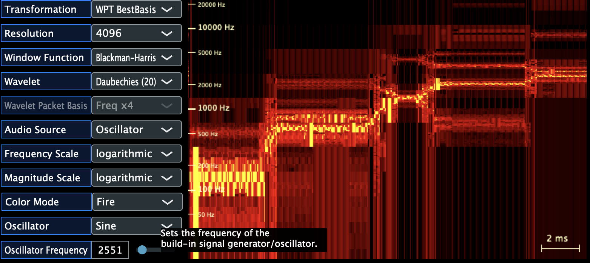

# Speclet User Guide

**Speclet** is a VST Audio Spectrum Analyzer Plugin using Fourier- and Wavelet-Transformation. It was written in 2011 for graduation at [Hochschule Mittweida - University of Applied Science](https://www.hs-mittweida.de/en) in Germany. 

**Speclet** shows the difference between FFT and Wavelet spectral transformation, their variations and parameters. It might not keep up with other analyzers currently available regarding features, but might help to get an overview of the fourier- and wavelet-transform and how to implement an analyzer with it. 

> **Speclet** is for the curious folks getting familiar with spectrum transformation and audio plugin development. 

## Transformation Methods

All transformation methods are implemented so that the audio samples are processed in blocks. The block size is a power of two (e.g. 212=4096) for efficient calculation.

The selected window function "rounds the edges" at the beginning and end of each audio block to avoid hard cuts (rectangular window) that would affect the displayed spectrum ("smearing").

### Fast Fourier Transform (FFT)
The (Short-Time) Fast Fourier Transform (FFT) is probably the most used, widely known and  most efficient implemented transform. 

A higher block size leads to a better frequency resolution at the cost of a lower time resolution, since it is not possible to tell where the frequency occurred within the block of samples. It is not possible to use a higher frequency resolution for low frequencies and a higher time resolution for high frequencies. The frequency lines are spread evenly/linear (every x Hz) across the spectrum.

 

### Fast Wavelet Transform (FWT)
The (dyadic) Fast Wavelet Transform (FWT) uses filters to split the audio spectrum in two halves. Every half is then down-sampled ("fully decimated") by removing ever second sample. The process is repeated for the lower half. 

This leads to a higher frequency resolution for low frequencies (multiple filtered) and a higher time resolution for high frequencies. The logarithmic approach better suit the way audio is perceived. For example is the difference between a 100Hz and a 200Hz tone more apparent than the same difference 10kHz higher between 10100Hz and 10200Hz. The opposite (frequency wise) applies to time resolution. A higher time resolution at higher frequencies is especially advantageous for percussive signals that start with a short high frequency part ("transient") that highly affect how they are perceived.

The wavelet functions are implemented as high pass FIR filters that extract the "detail" of the signal. The scaling function is derived from the wavelet function and is implemented as the matching low pass FIR filter that extract the "scale" of the signal. Higher order filters with more coefficients lead to a higher latency and need more processing power. However, they reduce aliasing effects and lead to "sharper" results. 

The fully decimated, down-sampled wavelet transform makes calculation more efficient.
The drawback is that this leads to aliasing that effects the displayed spectrum. Additionally, the lack of translation-invariance that comes with the fully decimated wavelet transform leads to a deviation in the spectrum for time shifts. An offset of a couple of samples at the input varies the spectrum even when the signal content is the same.

### Fast Wavelet Packet Transform (WPT)
The Fast Wavelet Packet Transform does - in comparison to the [FWT](#Fast-Wavelet-Transform-FWT) - also splits up the result of the high pass filter.
This leads to a higher frequency resolution and lower time resolution very similar to the [FFT](#Fast-Fourier-Transform-FFT). The additional filters raise calculation demands and latency. 

#### About swapped frequency bands
When the output of a high pass filter is decimated (taking every second sample to divide the sampling rate) and then further split into two frequency band, the resulting bands need to be swapped. 

Since the spectrum is folded at the Nyquist frequency, a down sampled signal, that mostly contains frequencies above the nyquist frequency (half the sampling rate) will be "folded back" so that the low frequencies appear on the higher half of the frequency band and vice versa. This is why the results of the Fast Wavelet Packet Transform need to be sorted/swapped before they can be displayed.

### Fast Wavelet Packet Best-Basis Transform
Fast Wavelet Packet Best-Basis Transform is a special form of the [WPT](#Fast-Wavelet-Packet-Transform-WPT) that fully utilizes the possible to decide which frequency band should be split further (more frequency details) or not (more time details). The filters are structured in a binary tree shape. Every "leaf" can be divided further on demand. The dyadic [FWT](#Fast-Wavelet-Transform-FWT) is special case of that. 

A cost function is used to decide for each band, if it is worth "the cost" to get further divided. When the spectrum doesn't change much over time, the band will be most likely divided further to get a higher frequency resolution. When the spectral content varies significantly over a short period of time, the band will most likely not be divided to preserve the higher time resolution.

This transformation is able to adapt its frequency- and time resolution dynamically and optimized for the processed signal and shows the capabilities and flexibility of the wavelet transform. This can be best seen at discontinuities of the input signal.

## Frequency- and Time-Resolution
The following figure shows how the frequency- and time-resolution looks like for different transformations:
 
Reference: 
[Comparison of Matching Pursuit Algorithm with Other Signal Processing Techniques for Computation of the Time-Frequency Power Spectrum of Brain Signals](https://www.jneurosci.org/content/36/12/3399)

A higher frequency resolution will lead to a lower possible time resolution and vice versa.
For more details look for the "Fourier uncertainty principle", e.g. [this article by John D. Cook](https://www.johndcook.com/blog/2021/03/17/fourier-uncertainty-principle).