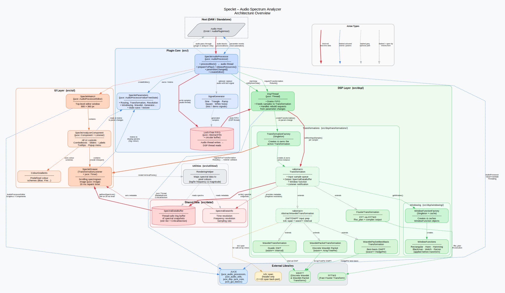

# Speclet Architecture

This document describes the high-level architecture of **Speclet**, an audio
spectrum analyzer plugin for VST3, AU, and Standalone formats. A complete visual
overview is provided in the [`architecture.gv`](architecture.gv) GraphViz diagram.

## Quick Overview

Speclet is a real-time audio spectrum analyzer built on:

- **JUCE** – audio plugin framework (AudioProcessor, ValueTree parameters, UI components)
- **FFTW3** – high-performance Fast Fourier Transform
- **wave++** – Discrete Wavelet Transform (DWT) and Discrete Wavelet Packet Transform (DWPT)
- **tcb::span** – safe array view utility

The plugin uses a **background DSP thread** to keep intensive spectral analysis
off the audio thread, supporting FFT, DWT, DWPT, and best-basis wavelet packet
transforms with configurable windowing functions.

## Architecture Diagram



Open [`architecture.gv`](architecture.gv) with any GraphViz viewer, or render it with the commands below:

### Rendering with GraphViz

Install GraphViz if you don't have it:

```bash
# macOS
brew install graphviz

# Ubuntu/Debian
sudo apt-get install graphviz

# Windows (via Chocolatey)
choco install graphviz
```

Render to various formats:

```bash
# SVG (best for web, zoom-friendly)
dot -Tsvg architecture.gv -o architecture.svg

# PNG (raster, good for static viewing)
dot -Tpng architecture.gv -o architecture.png

# PDF (print-friendly)
dot -Tpdf architecture.gv -o architecture.pdf

# View directly in your browser (macOS/Linux)
dot -Tsvg architecture.gv | open -a "Safari" /dev/stdin
```

### Diagram Layers & Colours

| Layer | Colour | Purpose |
|-------|--------|---------|
| **External Libraries** | Grey | JUCE, FFTW3, wave++, tcb::span |
| **Host** | Dashed outline | DAW or AudioPluginHost |
| **Plugin Core** | Blue | `SpecletAudioProcessor`, parameter state, lock-free FIFO, signal generator |
| **DSP** | Green | Background DSP thread, transformation factory, FFT/DWT/DWPT implementations, windowing |
| **Shared Data** | Red | Thread-safe spectral data buffers |
| **UI** | Orange | Editor window, analyzer component, spectrogram drawer, rendering helper |

### Edge Style Legend

- **Solid bold edges** (red) — Real-time audio/data flow
- **Dashed edges** (grey) — Control flow, configuration, library calls
- **Empty triangles** — Inheritance relationships

## Key Components

### SpecletAudioProcessor (Plugin Core)

The main JUCE `AudioProcessor`. Responsibilities:

- Receives audio blocks from the host in `processBlock()` on the audio thread
- Writes samples into a lock-free FIFO (no locks on audio thread)
- Manages the background DSP thread lifecycle
- Exposes `SpecletParameters` (JUCE `AudioProcessorValueTreeState`) for UI control
- Creates the editor UI on demand

### DspThread (DSP Background Thread)

Non-real-time background thread that:

- Drains the FIFO continuously
- Feeds samples to the active `Transformation`
- Handles transformation rebuilds when parameters change
- Never blocks the audio thread

### Transformation Hierarchy

Abstract base class with four concrete implementations:

- **FourierTransformation** — FFT via FFTW3
- **WaveletTransformation** — Dyadic Discrete Wavelet Transform (wave++)
- **WaveletPacketTransformation** — Discrete Wavelet Packet Transform (wave++)
- **WaveletPacketBestBasisTransformation** — Best-basis DWPT (wave++)

Each transformation:

- Accepts audio samples via `setNextInputSample()`
- Outputs spectral data to `SpectralDataBuffer`
- Applies a `WindowFunction` (Hann, Hamming, Blackman, etc.)
- Notifies UI listeners when new spectra are available

### UI (SpecletMainUI → SpecletAnalyzerComponent → SpecletDrawer)

- **SpecletMainUI** – top-level editor window (800 × 360 px)
- **SpecletAnalyzerComponent** – all control widgets (ComboBoxes, Sliders, Labels, tooltips)
- **SpecletDrawer** – scrolling spectrogram image updated on 20 ms timer
- **RenderingHelper** – converts spectral magnitude data to pixel colours (with log/lin scaling)

### Parameter Flow

1. User changes UI control (ComboBox selection, slider value)
2. JUCE `AudioProcessorValueTreeState` updates parameter
3. `Processor::parameterChanged()` fires
4. If transformation parameter → `DspThread::requestTransformationRebuild()`
5. DSP thread creates new transformation at next cycle (off audio thread)
6. UI repaints with new analysis

## Audio Flow

```
Audio Host
    ↓ (processBlock)
SpecletAudioProcessor
    ↓ (write samples)
Lock-Free FIFO
    ↓ (drain on DSP thread)
DspThread
    ↓ (feed samples)
Transformation (FFT / DWT / DWPT)
    ↓ (spectral output)
SpectralDataBuffer
    ↓ (poll on 20 ms timer)
SpecletDrawer
    ↓ (render colours)
Spectrogram Image
    ↓ (paint to screen)
Screen
```

## Threading Model

- **Audio Thread** – Host calls `processBlock()` every ~5–23 ms (depends on buffer size & sample rate)
  - Copies audio into lock-free FIFO (lock-free, no allocation, no blocking)
  - Signals DSP thread that data is available

- **DSP Thread** – Background `juce::Thread` runs continuously
  - Waits for signal (or timeout every 100 ms)
  - Drains FIFO into `Transformation`
  - Processes samples (FFT/DWT/DWPT)
  - Writes results to `SpectralDataBuffer`
  - Handles transformation rebuilds without interrupting audio

- **UI Thread** – Main thread
  - `SpecletDrawer` timer fires every 20 ms
  - Reads latest spectra from `SpectralDataBuffer` (protected by `CriticalSection`)
  - Renders to offscreen image, schedules repaint

## Excluding from Architecture

The following subsystems are **not** shown in the diagram (plugin-agnostic infrastructure):

- CMake build system and project configuration
- Unit test framework (Catch2) and test files
- CI/CD pipelines (GitHub Actions)
- Code linting, formatting, Renovate
- Documentation generation
- Version control and Git workflows

---

**Last Updated:** May 2026
**For Questions:** See [README.md](./../README.md) or [USERGUIDE.md](./../USERGUIDE.md)
